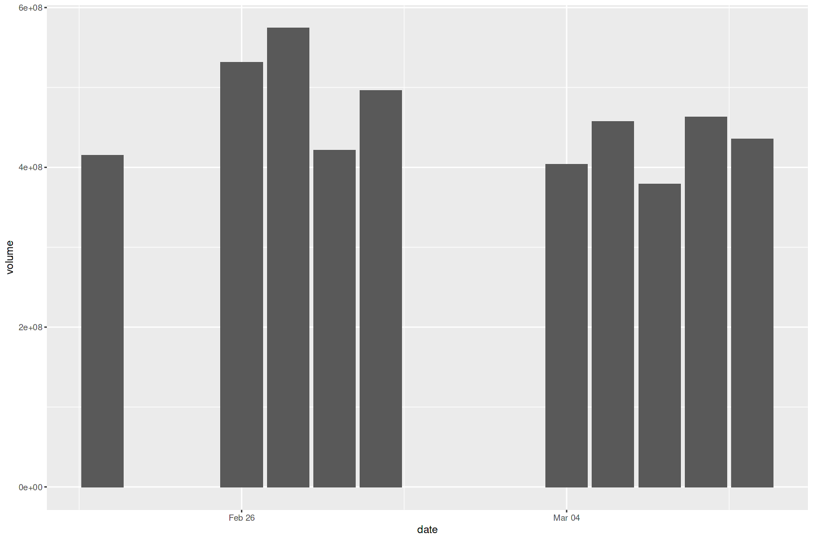
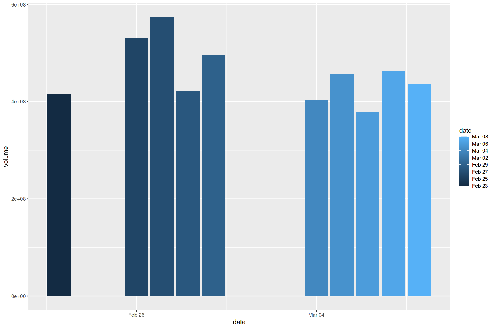
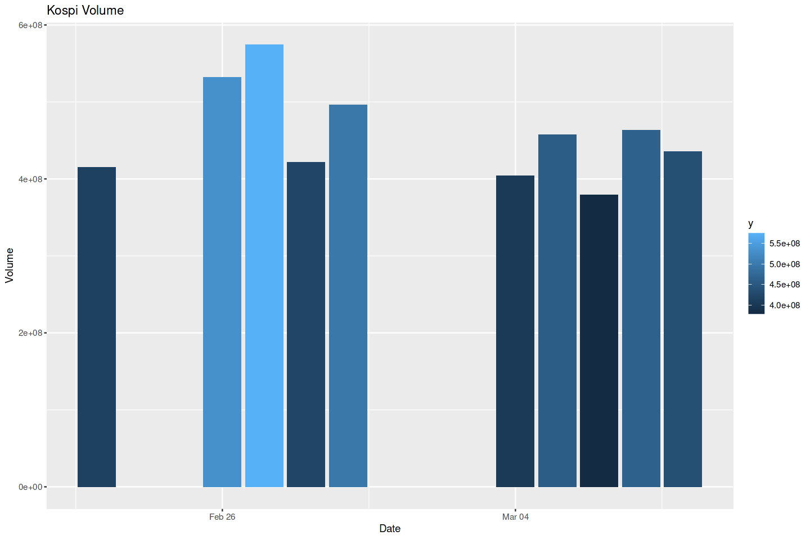
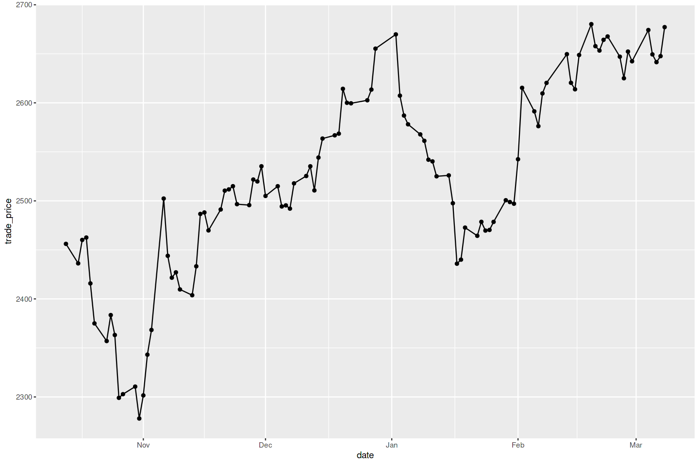
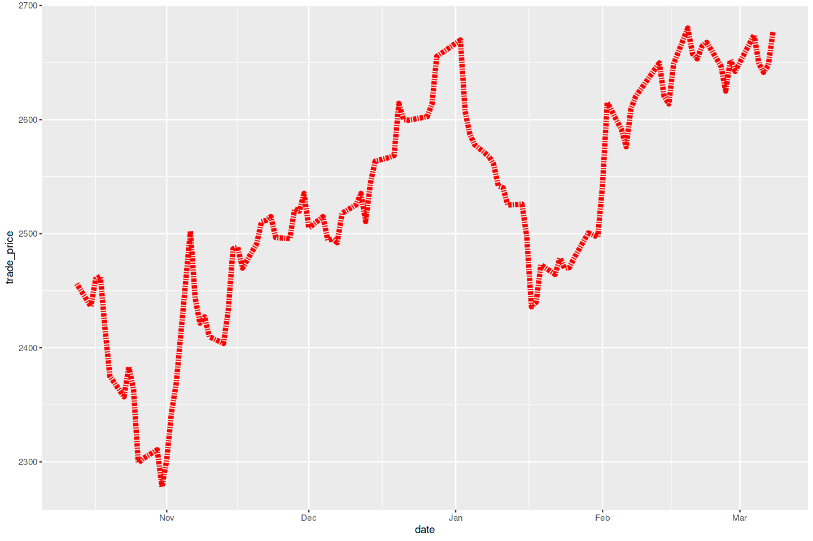
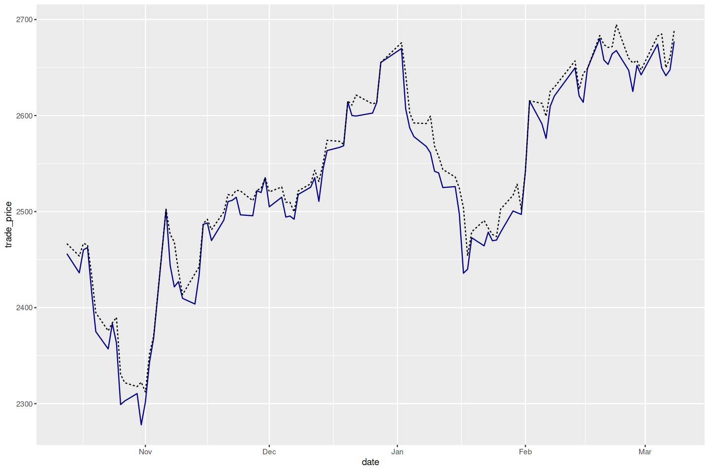
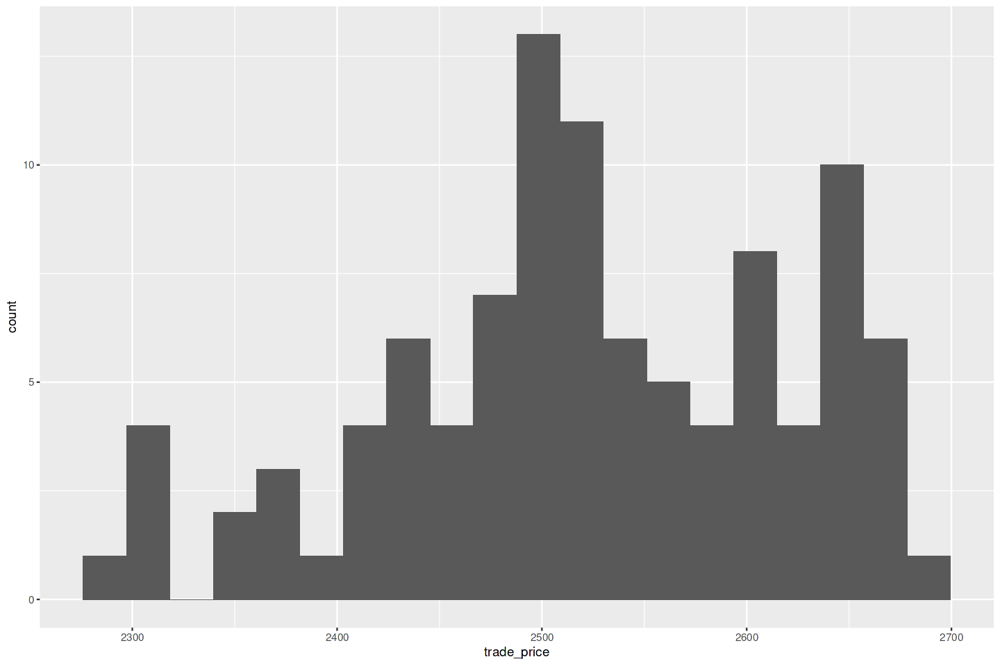
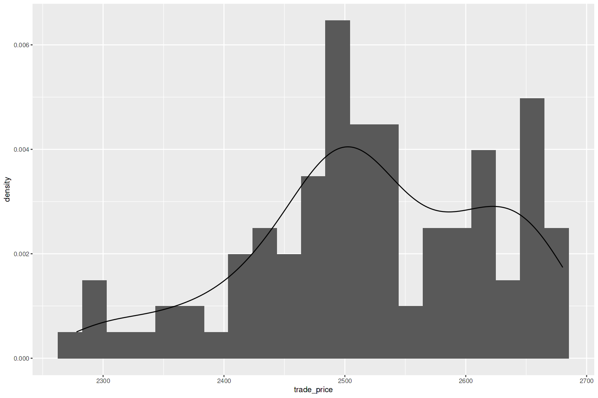
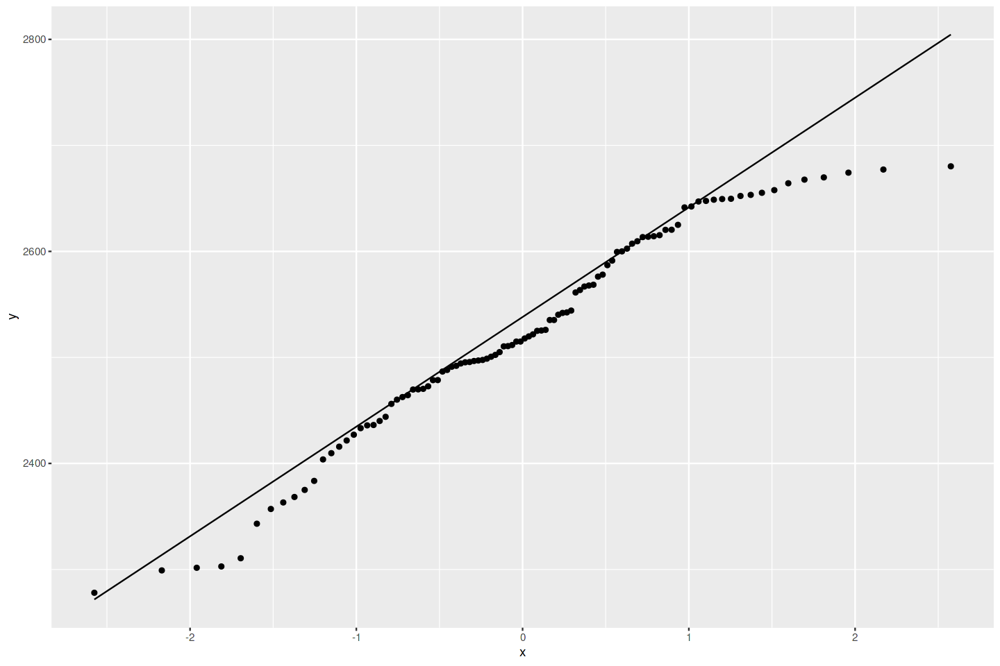
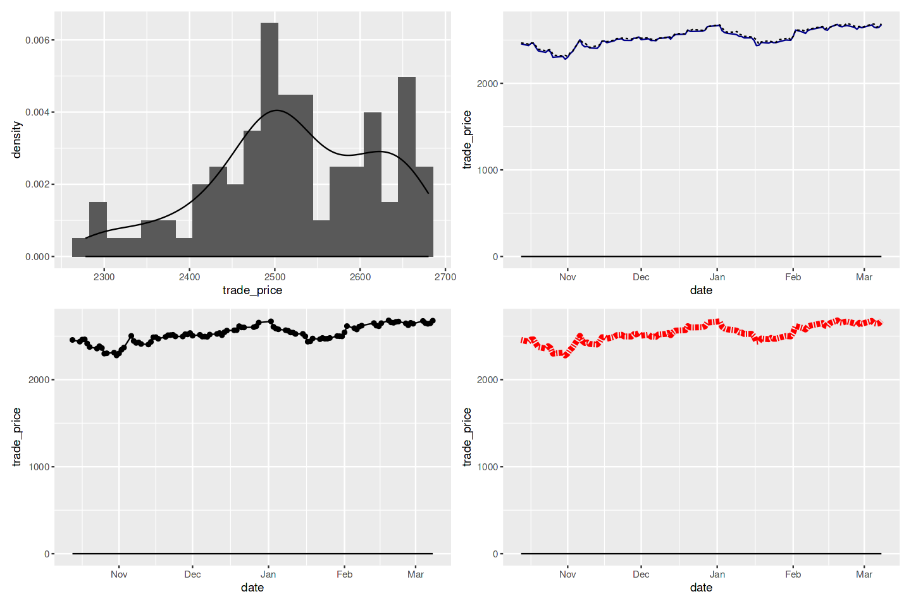

**1. 라이브러리 로드**


```R
library(tidyverse) # metapackage of all tidyverse packages

# Input data files are available in the read-only "../input/" directory
# For example, running this (by clicking run or pressing Shift+Enter) will list all files under the input directory

list.files(path = "../input")
org_df <- read_csv("/kaggle/input/kospi-20240308-csv/kospi_20240308.csv", show_col_types = FALSE)
tail(org_df)
```

    ── Attaching core tidyverse packages ──────────────────────── tidyverse 2.0.0 ──
    ✔ dplyr     1.1.4     ✔ readr     2.1.4
    ✔ forcats   1.0.0     ✔ stringr   1.5.1
    ✔ ggplot2   3.4.4     ✔ tibble    3.2.1
    ✔ lubridate 1.9.3     ✔ tidyr     1.3.0
    ✔ purrr     1.0.2     
    ── Conflicts ────────────────────────────────────────── tidyverse_conflicts() ──
    ✖ dplyr::filter() masks stats::filter()
    ✖ dplyr::lag()    masks stats::lag()
    ℹ Use the conflicted package (<http://conflicted.r-lib.org/>) to force all conflicts to become errors


'kospi-20240308-csv'


<table class="dataframe">
<caption>A tibble: 6 × 6</caption>
<thead>
	<tr><th scope=col>date</th><th scope=col>open_price</th><th scope=col>high_price</th><th scope=col>low_price</th><th scope=col>trade_price</th><th scope=col>volume</th></tr>
	<tr><th scope=col>&lt;date&gt;</th><th scope=col>&lt;dbl&gt;</th><th scope=col>&lt;dbl&gt;</th><th scope=col>&lt;dbl&gt;</th><th scope=col>&lt;dbl&gt;</th><th scope=col>&lt;dbl&gt;</th></tr>
</thead>
<tbody>
	<tr><td>2024-02-29</td><td>2643.48</td><td>2647.56</td><td>2628.62</td><td>2642.36</td><td>496064469</td></tr>
	<tr><td>2024-03-04</td><td>2664.52</td><td>2682.80</td><td>2662.32</td><td>2674.27</td><td>404014324</td></tr>
	<tr><td>2024-03-05</td><td>2660.80</td><td>2684.83</td><td>2649.35</td><td>2649.40</td><td>457237152</td></tr>
	<tr><td>2024-03-06</td><td>2638.84</td><td>2649.78</td><td>2630.16</td><td>2641.49</td><td>378993989</td></tr>
	<tr><td>2024-03-07</td><td>2653.98</td><td>2660.26</td><td>2633.57</td><td>2647.62</td><td>462910823</td></tr>
	<tr><td>2024-03-08</td><td>2676.79</td><td>2688.00</td><td>2668.38</td><td>2677.22</td><td>435697586</td></tr>
</tbody>
</table>


```R
# Function to set Height & Width
fig<-function(x,y){
    options(repr.plot.width = x, repr.plot.height = y)
    }

fig(12,8)
```

**2. 막대그래프 그리기**

문제 : 막대그래프를 그리고 싶다.

해결책 : ggplot의 geom_bar 함수를 사용하면 높이를 막대로 그릴 수 있다. 데이터가 이미 집계된 상태라면, stat = "identity"를 추가해서 ggplot이 그래프를 그리기에 앞서
집단별 집계를 하지 않도록 하면 된다.


```R
df = tail(org_df, 10)
ggplot(df, aes(x=date, y=volume)) +
       geom_bar(stat = "identity")
```


    

    


**3. 막대그래프 칠하기**

문제 : 막대그래프의 막대에 색을 칠하거나 음영을 넣고 싶다.

해결책 : ggplot에서 fill 매개변수를 aes 호출에 추가한 다음 ggplot이 색을 선정하도록 할 수 있다.


```R
ggplot(df, aes(x=date, y=volume, fill = date)) +
       geom_bar(stat = "identity")
```


    

    


```R
ggplot(df, aes(x=date, y=volume, fill = ..y..)) +
        geom_bar(stat = "identity") +
        labs(title = "Kospi Volume", x = "Date", y="Volume") 
        
```

    Warning message:
    “The dot-dot notation (`..y..`) was deprecated in ggplot2 3.4.0.
    ℹ Please use `after_stat(y)` instead.”


    

    


**4. x와 y점으로 선 그리기**

문제 : (x1,y1),(x2,y2),...,(xn,yn)처럼 쌍으로 된 관찰들이 데이터 프레임에 들어있다. 각 데이터 점을 연결하는 연속적인 선분들을 그리고 싶다.

해결책 : 점을 나타애기 위해서는 geom_point, 선을 나타내기 위해서는 geom_line을 사용한다. 두 종류의 도형을 함께 생성하는 방법으로 쉽게 점과 선을 함께 넣을 수 있다.


```R
df = tail(org_df, 100)
ggplot(df, aes(x=date, y=trade_price)) +
    geom_point() +
    geom_line()
```


    

    


**5. 선의 유형, 두께, 색상 변경하기**

ggplot 함수는 선의 외형을 조절하는 매개변수들을 가지고 있다. 옵션은 다음과 같다.

- 실선(기본): linetype="solid" 또는 linetype=1
- 대시선: linetype="dashed" 또는 linetype=2
- 점선: linetype="dotted" 또는 linetype=3
- 점대시선: linetype="dotdash" 또는 linetype=4
- 긴 대시선: linetype="longdash" 또는 linetype=5
- 이중 대시선: linetype="towdash" 또는 linetype=6
- 없음(그리기를 막음): linetype="blank" 또는 linetype=0


```R
ggplot(df, aes(x = date, y = trade_price)) + 
    geom_line(linetype = 6, 
              linewidth = 2,
              col ="red")
```


    

    


**6. 여러 개의 데이터세트를 그래프로 그리기**

문제 : 하나의 그래프에 여러 개의 데이터세트를 보여 주고 싶다.

해결책: 빈 그래프를 만들고 두개의 다른 도형을 추가하는 방법으로 ggplot 개체에 여러 데이터 프레임을 추가할 수 있다.


```R
df1 <- df2 <- df
ggplot() +
    geom_line(data=df1, aes(date, trade_price), color = "darkblue") +
    geom_line(data=df2, aes(date, high_price), linetype = "dashed")
```


    

    


**7. 히스토그램 그리기**

문제 : 데이터로 히스토그램을 그리고 싶다.

해결책 : geom_histogram을 사용하되 x를 수치형 값으로 이루어진 벡터로 준다.


```R
df = tail(org_df, 100)
ggplot(df) +
    geom_histogram(aes(x=trade_price), bins=20)
    
```


    

    


**8. 히스토그램에 추정 밀도 추가하기**

문제 : 데이터 표본으로 만든 히스토그램이 있는데, 여기에 추정된 밀도를 나타내기 위해서 곡선을 추가하고 싶다.

해결책 : geom_density 함수를 사용해서 표본 밀도의 근사치를 선으로 그린다.


```R
df = tail(org_df, 100)
ggplot(df) +
    aes(x = trade_price) +
    geom_histogram(aes( y=..density..), bins=21) +
    geom_density()
```


    

    


**9. 정규분포의 분위수-분위수 그래프 그리기**

문제 : 데이터의 분위수-분위수(Q-Q) 그래프를 생성하고 싶다. 일반적으로 데이터가 정규분포와 얼마나 다른지 알고 싶은 경우에 많이 사용한다.

해결책 : ggplot에서 stat_qq와 stat_qq_line 함수를 사용해서 관찰값을 나타내는 점들과 함께 Q-Q 선이 들어 있는 분위수-분위수(Q-Q) 그래프를 그릴수 있다. 


```R
ggplot(df, aes(sample=trade_price)) + 
    stat_qq() +
    stat_qq_line()
```


    

    


데이터가 정규분포인지 아닌지를 아는게 중요할 때가 있다.(정규분포는 데이터가 평균을 중심으로 좌우 대칭인 종 모양의 분포를 가지는 확률 분포). 이럴 때 Q-Q 그래프로 가장 먼저 확인해보면 된다. 데이터가 완벽히 정규분포 형태라면, 점들은 정확하게 대각선 위에 있을 것이다. 하지만 이 그래프를 보면 많은 점이 중간 부분에서는 대각선에 가깝지만, 끝으로 갈수록 꽤 떨어져 있다. 결론적으로 코스피 지수는 정규분포가 아니라고 볼 수 있다.

Chatgpt: 
코스피나 코스닥 지수와 같은 금융 시장 지수는 엄밀히 정규분포를 따르지 않습니다. 실제 금융 시장의 수익률 분포는 뾰족한 정상(Leptokurtic)과 두꺼운 꼬리(Fat tails)를 가진 경향이 있어, 정규분포보다 극단적인 값이 더 자주 나타납니다. 이러한 특성은 '금융 시장에서는 예상보다 극단적인 사건이 더 자주 발생한다'는 것을 의미하며, 이를 '금융시장의 변동성 클러스터링 현상'이라고 부르기도 합니다. 따라서, 금융 데이터 분석에는 정규분포보다는 더 복잡한 확률 분포 모델을 사용하는 것이 적합합니다

**10. 한 페이지에 그래프 여러개 그리기**

문제 : 한 페이지에 여러 개의 그래프를 나란히 놓고 싶다.

해결책: ggplot 그래픽들을 그리드에 넣는 방법은 여러 가지지만, 가장 쉬운 방법은 토머스 린 페데르센(Thomas Lin Pedersen)의 patchwork를 이해하고 사용하는 것이다. patchwork는 현재 CRAN에 올려져 있지 않지만, devtools를 사용해 깃허브에서 설치할수 있다. 패키지를 설치한 후, ggplot 객체들 사이에 + 를 넣어 다수의 그래프를 그린 다음 plot_layout을 호출해서 이미지들을 그리드로 정렬할 수 있다. 


```R
if(!require(patchwork)) devtools::install_github("thomasp85/patchwork")
library(patchwork)

df = tail(org_df, 100)
g1 = ggplot(df) +
    aes(x = trade_price) +
    geom_histogram(aes( y=..density..), bins=21) +
    geom_density()

g2 = ggplot() +
    geom_line(data=df1, aes(date, trade_price), color = "darkblue") +
    geom_line(data=df2, aes(date, high_price), linetype = "dashed")

g3 = ggplot(df, aes(x=date, y=trade_price)) +
    geom_point() +
    geom_line()

g4 = ggplot(df, aes(x = date, y = trade_price)) + 
    geom_line(linetype = 6, 
              linewidth = 2,
              col ="red")

g1 <- g1 + stat_function(fun = function(x) dbeta(x,2,4))
g2 <- g2 + stat_function(fun = function(x) dbeta(x,4,1))
g3 <- g3 + stat_function(fun = function(x) dbeta(x,1,1))
g4 <- g4 + stat_function(fun = function(x) dbeta(x,1,1))
                                                  

g1 + g2 + g3 + g4 + plot_layout(ncol = 2, byrow = TRUE)
```

    Loading required package: patchwork
    


    

    

